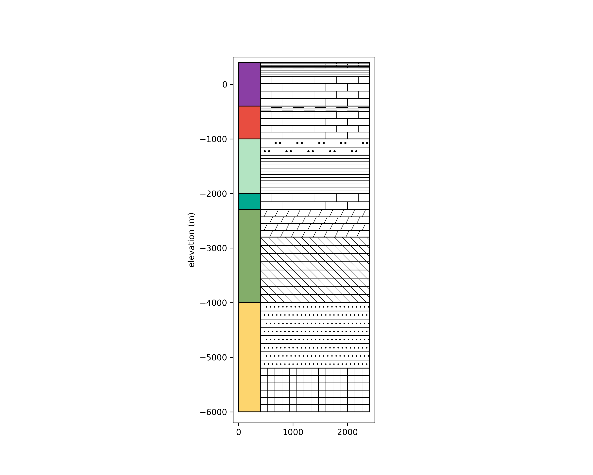

# Py-lithology-Pa Version 1.0

Using python to plot some lithology patterns commonly used in geology. (Early Version)

## Features

- Plotting of lithology patterns using Python.
- Symbols are based on common geological standards.
- All plots are generated entirely using Python, relying on libraries such as `numpy`, `pandas`, and `matplotlib`.

## References

- **Lithology Symbol Reference:** https://ngmdb.usgs.gov/fgdc_gds/geolsymstd/fgdc-geolsym-patternchart.pdf
- **Geological Time Color Reference:** https://stratigraphy.org/ICSchart/ChronostratChart2024-12.pdf

## Example

See the sample image below for an example of the output:



## Limitations

- Currently supports only rectangular pattern rendering.
- More complex patterns can be created by combining polygonal masks.

## Requirements

You may need to install the following Python packages:

```bash
pip install numpy pandas matplotlib
```
